---
title: "Urban Growth Modeling - Delaware Valley Region"
author: "Leila Bahrami"
date: '2024-10-13'
output: 
  html_document:
    keep_md: yes
    toc: yes
    theme: flatly
    toc_float: yes
    code_folding: hide
    number_sections: yes
  pdf_document:
    toc: yes
--- 
  
# Executive Summary
Comprehensive regional development rooted in multi-nodal growth engines has been the new norm in the context of American urban planning. Cross-boundary collaboration brings benefits towards resource distribution, balanced growth, and overall sustainable development. Conjoining Pennsylvania, New Jersey, and Delaware and in proximity to New York City and Washington D.C., the Delaware Valley Region (DVR) serves as an example of regional collaboration in growth management. Over the next ten to thirty years, the region anticipates a potential increase in population joining the workforce, along with the expansion and enhancement of regional infrastructure networks. 

This report will summarize our recent study predicting future development demand based on the demand-driven factor of population change and the supply-driven factor of infrastructure network enhancement. 

We utilize multiple datasets, including Land Cover and Land Cover Change from USGS, Census demographics, and transportation data. Spatial lag features are developed from the land cover change data, hypothesizing that patterns of development from 2000 to 2010 can forecast development in 2020.

An exploratory analysis investigates the relationship between development and these factors. The analysis informs a geospatial predictive model, trained on development patterns from 2001 to 2011, to predict new development in 2020. While the goal is not to create the most precise model, this exercise demonstrates how geospatial machine learning can be applied to the land use planning process.

Once the predictions are validated for accuracy and spatial applicability, they are evaluated against environmentally sensitive areas across the Delaware Valley, particularly with respect to landscape fragmentation. The final section of this chapter focuses on using the model’s predictions to allocate new development in locations that support economic growth while upholding sustainability objectives.
    
# Background
The DVR as the core urban cluster of the Greater Philadelphia Region connects five adjacent states. Despite a population increase from 5.1 million to 5.6 million, the developed area has expanded by 1.5 times, indicating substantial urban sprawl.
The DVR region is projected to experience a population increase of over 658,000 residents and the creation of more than 372,000 job opportunities from 2015 to 2045 (DVRPC, 2017). The ongoing rapid urban sprawl poses a significant environmental threat. Therefore, conducting a projection study on future development demand will help us observe development patterns and strategically address sprawl by formulating effective policy instruments.
    
# Data and Study Methods
The study adopted a quantitative approach using spatial and demographic data, along with regression analysis to predict future development demands.  
  
## Setup 

Below we load the libraries needed for the analysis as well as a mapTheme and plotTheme. A set of palette colors are also specified.


``` r
knitr::opts_chunk$set(
	echo = TRUE,
	message = FALSE,
	warning = FALSE,
	cache = TRUE
)
library(tidyverse)
library(sf)
library(raster)
library(knitr)
library(kableExtra)
library(tidycensus)
library(tigris)
library(FNN)
library(QuantPsyc)
library(caret)
library(yardstick)
library(pscl)
library(plotROC) 
library(ggrepel)
library(pROC)
library(grid)
library(gridExtra)
library(viridis)

mapTheme <- function(base_size = 12) {
  theme(
    text = element_text( color = "black"),
    plot.title = element_text(size = 14,colour = "black"),
    plot.subtitle=element_text(face="italic"),
    plot.caption=element_text(hjust=0),
    axis.ticks = element_blank(),
    panel.background = element_blank(),axis.title = element_blank(),
    axis.text = element_blank(),
    axis.title.x = element_blank(),
    axis.title.y = element_blank(),
    panel.grid.minor = element_blank(),
    panel.border = element_rect(colour = "black", fill=NA, size=2)
  )
}

plotTheme <- function(base_size = 12) {
  theme(
    text = element_text( color = "black"),
    plot.title = element_text(size = 14,colour = "black"),
    plot.subtitle = element_text(face="italic"),
    plot.caption = element_text(hjust=0),
    axis.ticks = element_blank(),
    panel.background = element_blank(),
    panel.grid.major = element_line("grey80", size = 0.1),
    panel.grid.minor = element_blank(),
    panel.border = element_rect(colour = "black", fill=NA, size=2),
    strip.background = element_rect(fill = "grey80", color = "white"),
    strip.text = element_text(size=12),
    axis.title = element_text(size=12),
    axis.text = element_text(size=10),
    plot.background = element_blank(),
    legend.background = element_blank(),
    legend.title = element_text(colour = "black", face = "italic"),
    legend.text = element_text(colour = "black", face = "italic"),
    strip.text.x = element_text(size = 14)
  )
}

palette2 <- c("#41b6c4","#253494")
palette4 <- c("#a1dab4","#41b6c4","#2c7fb8","#253494")
palette5 <- c("#ffffcc","#a1dab4","#41b6c4","#2c7fb8","#253494")
palette10 <- c("#f7fcf0","#e0f3db","#ccebc5","#a8ddb5","#7bccc4",
               "#4eb3d3","#2b8cbe","#0868ac","#084081","#f7fcf0")
```


# Data and Study Methods
The study adopted a quantitative approach using spatial and demographic data, along with regression analysis to predict future development demands.
  
## Land cover change data
The dependent variable we wish to forecast is land cover change between 2001 and 2011. Land cover datasets in 2000 to 2010 were obtained from USGS and reclassified to show only development category.


``` r
DVR <- st_read("Data/DVR_boundaryproj.shp")

lc_change = raster("Data/lc_chang_1kproj.tif")

ggplot() +
  geom_sf(data=DVR) +
  geom_raster(data=rast(lc_change) %>% na.omit, 
              aes(x,y,fill=as.factor(value))) +
  scale_fill_viridis(discrete=TRUE, name ="Land Cover\nChange") + 
  labs(title="Development land use change") +
  mapTheme()
```

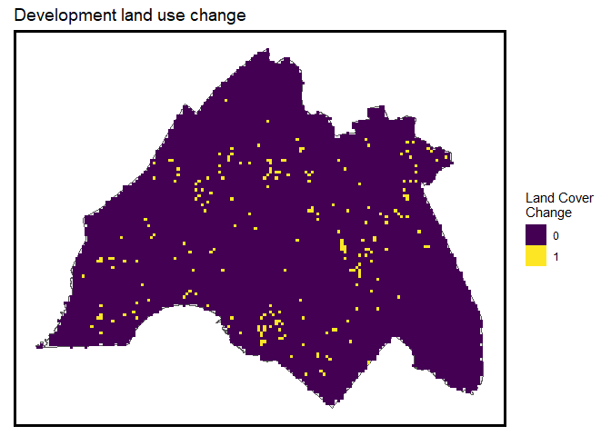<!-- -->
Next, we reclassify the raster such that all the developed grid cell values receive a value of 1 and all other values receive a value of 0. This is done using a reclassify matrix.


``` r
reclassMatrix <- 
  matrix(c(
    0,0,0,
    1,1,1,
    1,Inf,0),
    ncol=3, byrow=T)

lc_change2 <- 
  reclassify(lc_change,reclassMatrix)

lc_change2[lc_change2 < 1] <- NA

names(lc_change2) <- "lc_change"

ggplot() +
  geom_sf(data=DVR) +
  geom_raster(data=rast(lc_change2) %>% na.omit, 
              aes(x,y,fill=as.factor(value))) +
  scale_fill_viridis(discrete=TRUE, name ="Land Cover\nChange") + 
  labs(title="Development land use change") +
  mapTheme()
```

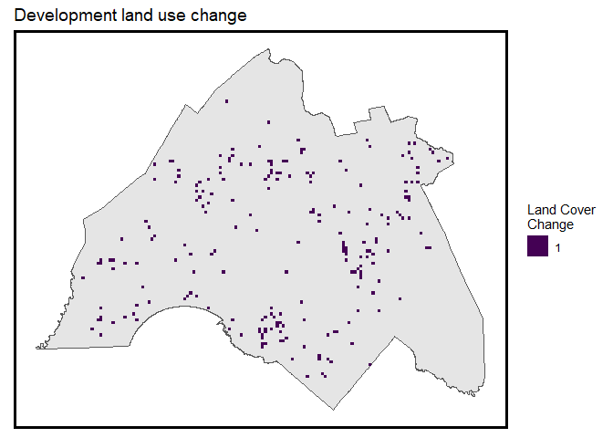<!-- -->

Next, the fishnet is created at 4000 by 4000 feet resolution and subset it to the Delaware Valley Region with st_intersection. 


``` r
DVR_fishnet <- 
  st_make_grid(DVR, 4000) %>%
  st_sf()

DVR_fishnet <-
  DVR_fishnet[DVR,]

ggplot() +
  geom_sf(data=DVR_fishnet) +
  labs(title="Fishnet, 4000 foot resolution") +
  mapTheme()
```

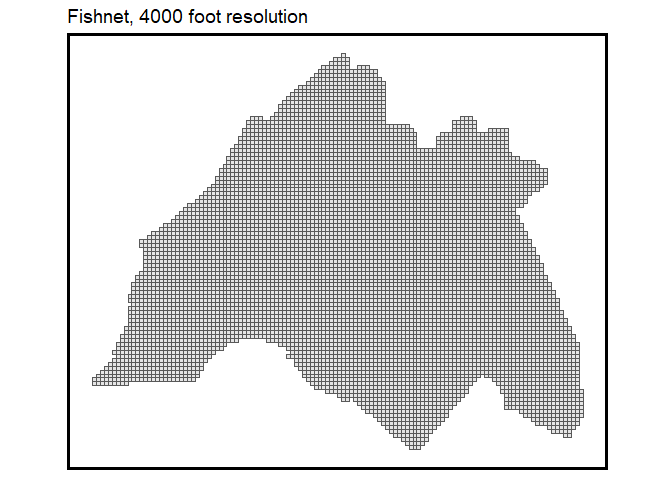<!-- -->
Then the raster is converted to points, which makes its joining to the vector fishnet a bit faster. 

``` r
changePoints <-
  rasterToPoints(lc_change2) %>%
  as.data.frame() %>%
  st_as_sf(coords = c("x", "y"), crs = st_crs(DVR_fishnet))


fishnet <- 
  aggregate(changePoints, DVR_fishnet, sum) %>%
  mutate(lc_change = ifelse(is.na(lc_change),0,1),
         lc_change = as.factor(lc_change))

na.omit(fishnet, lc_change) %>% 
ggplot() +
  geom_sf(data=DVR) +
  geom_point(data=fishnet, 
             aes(x=xyC(fishnet)$x, y=xyC(fishnet)$y, colour=lc_change)) +
    scale_colour_manual(values = palette2,
                      labels=c("No Change","New Development"),
                      name = "") +
  labs(title = "Land cover development change", subtitle = "As fishnet centroids") +
  mapTheme()
```

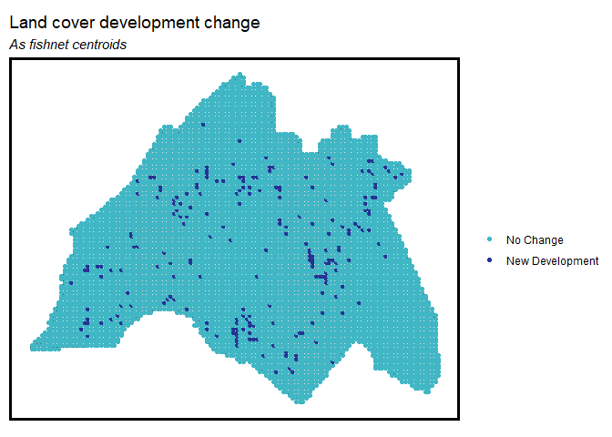<!-- -->
## Land Cover in 2001
It is reasonable to hypothesize that the propensity of new development is a function of existing land cover categories. In this section we identify these other land cover categories from 2001 and integrate each with the fishnet.


``` r
lc_2001 <- raster("Data/lc_2001_1kproj.tif")

ggplot() +
  geom_sf(data=DVR) +
  geom_raster(data=rast(lc_2001) %>% na.omit %>% filter(value > 0), 
              aes(x,y,fill=as.factor(value))) +
  scale_fill_viridis(discrete=TRUE, name ="") +
  labs(title = "Land Cover, 2001") +
  mapTheme()
```

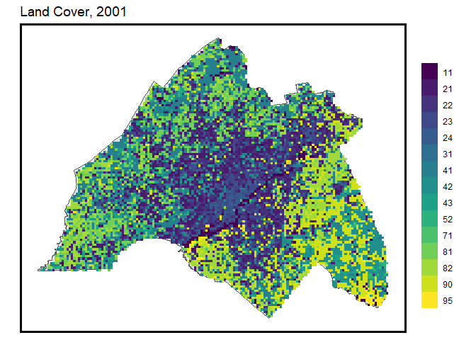<!-- -->

The table below shows the approach taken to recorded existing land cover codes into the categories used in our analysis. 

``` r
developed <- lc_2001 == 21 | lc_2001 == 22 | lc_2001 == 23 | lc_2001 == 24
forest <- lc_2001 == 41 | lc_2001 == 42 | lc_2001 == 43 
farm <- lc_2001 == 81 | lc_2001 == 82 
wetlands <- lc_2001 == 90 | lc_2001 == 95 
otherUndeveloped <- lc_2001 == 52 | lc_2001 == 71 | lc_2001 == 31 
water <- lc_2001 == 11

names(developed) <- "developed"
names(forest) <- "forest"
names(farm) <- "farm"
names(wetlands) <- "wetlands"
names(otherUndeveloped) <- "otherUndeveloped"
names(water) <- "water"
```
Next, each raster is aggregated to the fishnet by way of a function called aggregateRaster. 


``` r
aggregateRaster <- function(inputRasterList, theFishnet) {
  #create an empty fishnet with the same dimensions as the input fishnet
  theseFishnets <- theFishnet %>% dplyr::select()
  #for each raster in the raster list
  for (i in inputRasterList) {
    #create a variable name corresponding to the ith raster
    varName <- names(i)
    #convert raster to points as an sf
    thesePoints <-
      rasterToPoints(i) %>%
      as.data.frame() %>%
      st_as_sf(coords = c("x", "y"), crs = st_crs(theFishnet)) %>%
      filter(.[[1]] == 1)
    #aggregate to the fishnet
    thisFishnet <-
      aggregate(thesePoints, theFishnet, length) %>%
      mutate(!!varName := ifelse(is.na(.[[1]]),0,1))
    #add to the larger fishnet
    theseFishnets <- cbind(theseFishnets,thisFishnet)
  }
  #output all aggregates as one large fishnet
  return(theseFishnets)
}
```
The theRasterList of land cover types in 2001 is created and then fed into aggregateRaster. The result is converted to long form grid cell centroids and plot as small multiple maps.


``` r
theRasterList <- c(developed,forest,farm,wetlands,otherUndeveloped,water)

aggregatedRasters <-
  aggregateRaster(theRasterList, DVR_fishnet) %>%
  dplyr::select(developed,forest,farm,wetlands,otherUndeveloped,water) %>%
  mutate_if(is.numeric,as.factor)


aggregatedRasters %>%
  gather(var,value,developed:water) %>%
  st_cast("POLYGON") %>%    #just to make sure no weird geometries slipped in
  mutate(X = xyC(.)$x,
         Y = xyC(.)$y) %>%
  ggplot() +
  geom_sf(data=DVR) +
  geom_point(aes(X,Y, colour=as.factor(value))) +
  facet_wrap(~var) +
  scale_colour_manual(values = palette2, na.translate = F,
                      labels=c("Other","Land Cover"),
                      name = "") +
  labs(title = "Land cover types, 2001",
       subtitle = "As fishnet centroids") +
  mapTheme()
```

<!-- -->

## Major Development Engines 
Population is the foremost driving factor in development since an increase in population will bring about growth of density and employment.Census data for both 2000 and 2010 is downloaded using the tidycensus package. As illustrated below, these data are downloaded at a census tract geography and thus, a technique called areal weighted interpolation used to reconcile tracts and fishnet geometries.


``` r
PAPop00 <- 
  get_decennial(geography = "tract", variables = "P001001", year = 2000,
                state =42, geometry = TRUE, 
                county=c("Bucks","Montgomery",
                         "Chester","Philadelphia","Delaware")) %>%
  rename(pop_2000 = value) %>%
  st_transform(st_crs(DVR_fishnet))

NJPop00 <- 
  get_decennial(geography = "tract", variables = "P001001", year = 2000,
                state =34, geometry = TRUE, 
                county=c("Mercer","Camden","Gloucester","Burlington")) %>%
  rename(pop_2000 = value) %>%
  st_transform(st_crs(DVR_fishnet))  
  
DVRPop00 <- rbind(PAPop00, NJPop00)%>%
    st_transform(st_crs(DVR_fishnet)) 
```

``` r
PAPop10 <- 
  get_decennial(geography = "tract", variables = "P001001", year = 2010,
                state =42, geometry = TRUE, 
                county=c("Bucks","Montgomery",
                         "Chester","Philadelphia","Delaware"))

NJPop10 <- 
  get_decennial(geography = "tract", variables = "P001001", year = 2010,
                state =34, geometry = TRUE, 
                county=c("Mercer","Camden","Gloucester","Burlington"))  

DVRPop10 <- rbind(PAPop10, NJPop10)%>%
  rename(pop_2010 = value) %>%
  st_transform(st_crs(DVR_fishnet)) %>%
  st_buffer(-1)
```

``` r
grid.arrange(
  ggplot() +
    geom_sf(data = DVRPop00, aes(fill=factor(ntile(pop_2000,5))), colour=NA) +
    scale_fill_manual(values = palette5,
                      labels=quintileBreaks(DVRPop00,"pop_2000"),
                      name="Quintile\nBreaks") +
    labs(title="Population, DVR: 2000") +
    mapTheme(),
  
  ggplot() +
    geom_sf(data = DVRPop10, aes(fill=factor(ntile(pop_2010,5))), colour=NA) +
    scale_fill_manual(values = palette5,
                      labels=quintileBreaks(DVRPop10,"pop_2010"),
                      name="Quintile\nBreaks") +
    labs(title="Population, DVR: 2010") +
    mapTheme(), ncol=2)
```

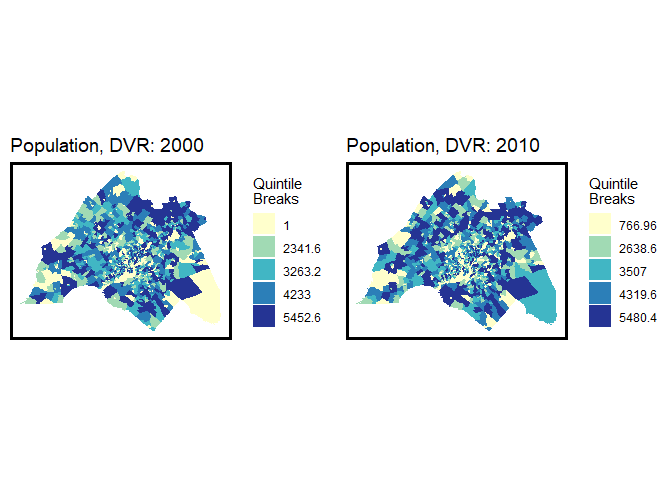<!-- -->
Now to reconcile tract boundaries and fishnet grid cells, the area weighted interpolation function, st_interpolate_aw, assigns a proportion of a tract’s population to a grid cell weighted by the proportion of the tract that intersects the grid cell. 


``` r
DVR_fishnet <-
  DVR_fishnet %>%
  rownames_to_column("fishnetID") %>% 
  mutate(fishnetID = as.numeric(fishnetID)) %>%
  dplyr::select(fishnetID)

fishnetPopulation00 <-
  st_interpolate_aw(DVRPop00["pop_2000"],DVR_fishnet, extensive=TRUE) %>%
  as.data.frame(.) %>%
  rownames_to_column("fishnetID") %>%
  mutate(fishnetID = as.numeric(fishnetID)) %>%
  left_join(DVR_fishnet, ., by=c("fishnetID")) %>% 
  mutate(pop_2000 = replace_na(pop_2000,0)) %>%
  dplyr::select(pop_2000)

fishnetPopulation10 <-
  st_interpolate_aw(DVRPop10["pop_2010"],DVR_fishnet, extensive=TRUE) %>%
  as.data.frame(.) %>%
  rownames_to_column("fishnetID") %>%
  mutate(fishnetID = as.numeric(fishnetID)) %>%
  left_join(DVR_fishnet, ., by=c("fishnetID")) %>%
  mutate(pop_2010 = replace_na(pop_2010,0)) %>%
  dplyr::select(pop_2010)

fishnetPopulation <- 
  cbind(fishnetPopulation00,fishnetPopulation10) %>%
  dplyr::select(pop_2000,pop_2010) %>%
  mutate(pop_Change = pop_2010 - pop_2000)
```
For comparison purposes, both the 2010 census tract geometries and the population weighted grid cells are plot.


``` r
grid.arrange(
  ggplot() +
    geom_sf(data=DVRPop10, aes(fill=factor(ntile(pop_2010,5))),colour=NA) +
    scale_fill_manual(values = palette5,
                      labels=substr(quintileBreaks(DVRPop10,"pop_2010"),1,4),
                      name="Quintile\nBreaks") +
    labs(title="Population, DVR: 2010",
         subtitle="Represented as tracts; Boundaries omitted") +
    mapTheme(),
  
  ggplot() +
    geom_sf(data=fishnetPopulation, aes(fill=factor(ntile(pop_2010,5))),colour=NA) +
    scale_fill_manual(values = palette5,
                      labels=substr(quintileBreaks(fishnetPopulation,"pop_2010"),1,4),
                      name="Quintile\nBreaks") +
    labs(title="Population, DVR: 2010",
         subtitle="Represented as fishnet gridcells; Boundaries omitted") +
    mapTheme(), ncol=2)
```

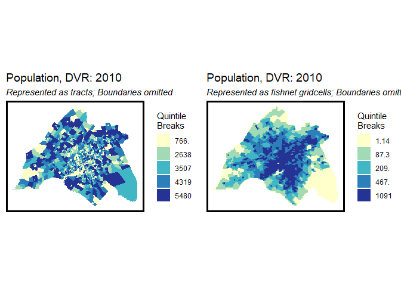<!-- -->
## Highway distance
The road network is a crucial factor in development. Given the prevalent high level of auto-dependency and the resulting focus on highway-oriented development patterns, it is expected that development demand is likely to be concentrated near highways to facilitate better connections to various destinations.
First, the highway layer is converted to raster. This is done by creating an emptyRaster of NA grid cells at the same spatial extent as lc_change. Then, highway_raster is created by converting DVRHighways to sp form and then to applying rasterize. The raster is then converted to points with rasterToPoints and st_as_sf, then aggregate is used to calculate mean distance by grid cell.


``` r
DVRHighways <-
  read_sf("Data/DVR_highway2proj.shp") %>%
  st_transform(st_crs(DVR)) %>%
  st_intersection(DVR)

ggplot() +
  geom_point(data=fishnet, 
             aes(x=xyC(fishnet)[,1], y=xyC(fishnet)[,2],colour=lc_change),size=1.5) +
  geom_sf(data=DVRHighways) +
  scale_colour_manual(values = palette2,na.translate = F,
                      labels=c("No Change","New Development")) +
  labs(title = "New Development and Highways",
       subtitle = "As fishnet centroids") +
  mapTheme()
```

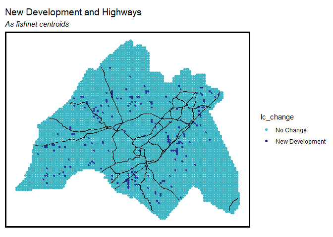<!-- -->

``` r
emptyRaster <- lc_change
emptyRaster[] <- NA


highway_raster <- 
  as(DVRHighways,'Spatial') %>%
  rasterize(.,emptyRaster)

highway_raster_distance <- distance(highway_raster)
names(highway_raster_distance) <- "distance_highways"

highwayPoints <-
  rasterToPoints(highway_raster_distance) %>%
  as.data.frame() %>%
  st_as_sf(coords = c("x", "y"), crs = st_crs(DVR_fishnet))


highwayPoints_fishnet <- 
  aggregate(highwayPoints, DVR_fishnet, mean) %>%
  mutate(distance_highways = ifelse(is.na(distance_highways),0,distance_highways))

ggplot() +
  geom_sf(data=DVR) +
  geom_point(data=highwayPoints_fishnet, aes(x=xyC(highwayPoints_fishnet)[,1], 
                                             y=xyC(highwayPoints_fishnet)[,2], 
                                             colour=factor(ntile(distance_highways,5))),size=1.5) +
  scale_colour_manual(values = palette5,
                      labels=substr(quintileBreaks(highwayPoints_fishnet,"distance_highways"),1,8),
                      name="Quintile\nBreaks") +
  geom_sf(data=DVRHighways, colour = "red") +
  labs(title = "Distance to Highways",
       subtitle = "As fishnet centroids; Highways visualized in red") +
  mapTheme()
```

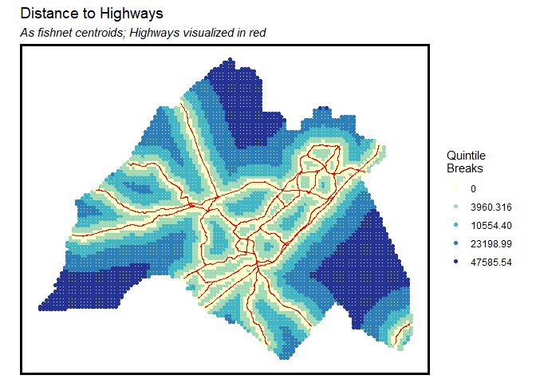<!-- -->
  
## Method
To ensure a high level of accuracy, the study divided the approximately 8 thousand square kilometers of land into over 12 million grids, using roughly one-acre grids as the units of analysis. Spatial data, including information on land cover change, population distribution, and distance to highways, was incorporated into both the 2000 and 2010 grids. Logit regression analysis was then applied to study development patterns.1. Based on the hypothesis that future development demand shares continuity of current development, the patterns learned from the previous decade would serve as the model of development demands in the upcoming decades. Projections for both demand-side and supply-side development demands are made based on future population projections and a proposed highway, respectively.  

# Machine Learning of Development Patterns  

## The spatial lag of development
At the core of our model is the idea that development demand is influenced by existing development patterns. Development occurs where the market expects a return on investment, as seen in regions like Delaware valley Region, where farmland is converted to suburban housing.

The traditional "bid-rent" model links development demand to accessibility, favoring central locations. However, in sprawling areas like Delaware valley Region, suburban locations also attract demand due to larger lots, cheaper land, and access to better public services. Developers are drawn to cheaper, peripheral "greenfield" sites, even at the cost of leapfrogging further out, which can fragment natural areas and complicate infrastructure deployment.

In sprawling regions, both accessibility-based and leapfrog development patterns coexist. To model these patterns, we create features measuring accessibility through spatial lag—specifically, the distance from each grid cell to nearby developed areas. This distance metric helps predict where new development is likely to occur. While we estimate models using logistic regression, machine learning algorithms like Random Forest are better suited to handle spatial complexities.

In this case, accessibility is measured by calculating the average distance from each grid cell to its two nearest developed neighbors in 2001, providing a spatial foundation for forecasting future growth.

``` r
nn_function <- function(measureFrom,measureTo,k) {
  #convert the sf layers to matrices
  measureFrom_Matrix <-
    as.matrix(measureFrom)
  measureTo_Matrix <-
    as.matrix(measureTo)
  nn <-   
    get.knnx(measureTo, measureFrom, k)$nn.dist
  output <-
    as.data.frame(nn) %>%
    rownames_to_column(var = "thisPoint") %>%
    gather(points, point_distance, V1:ncol(.)) %>%
    arrange(as.numeric(thisPoint)) %>%
    group_by(thisPoint) %>%
    summarize(pointDistance = mean(point_distance)) %>%
    arrange(as.numeric(thisPoint)) %>% 
    dplyr::select(-thisPoint) %>%
    pull()
  
  return(output)  
}
```
The map below illustrates relative accessibility from every grid cell to nearby development.

``` r
fishnet$lagDevelopment <-
  nn_function(xyC(fishnet),
              xyC(filter(aggregatedRasters,developed==1)),
              2)
ggplot() +
  geom_sf(data=DVR) +
  geom_point(data=fishnet,
             aes(x=xyC(fishnet)[,1], y=xyC(fishnet)[,2], 
                 colour=factor(ntile(lagDevelopment,5))), size=1.5) +
  scale_colour_manual(values = palette5,
                      labels=substr(quintileBreaks(fishnet,"lagDevelopment"),1,7),
                      name="Quintile\nBreaks") +
  labs(title = "Spatial lag to 2001 development",
       subtitle = "As fishnet centroids") +
  mapTheme()
```

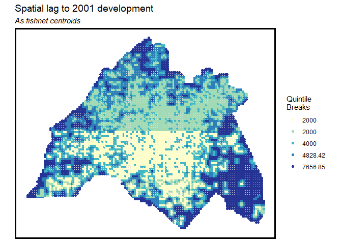<!-- -->
## DVR Counties
The counties for Delaware valley Region is downloaded and illustrated as below.

``` r
options(tigris_class = "sf")

PACounties <- 
  counties("Pennsylvania") %>%
  st_transform(st_crs(DVR)) %>%
  dplyr::select(NAME) %>%
  .[st_buffer(DVR,-1000), , op=st_intersects]

NjCounties <- 
  counties("New Jersey") %>%
  st_transform(st_crs(DVR)) %>%
  dplyr::select(NAME) %>%
  .[st_buffer(DVR,-1000), , op=st_intersects]

studyAreaCounties <- rbind(PACounties, NjCounties)

ggplot() +
  geom_sf(data=studyAreaCounties) +
  labs(title = "Study area counties") +
  mapTheme()
```

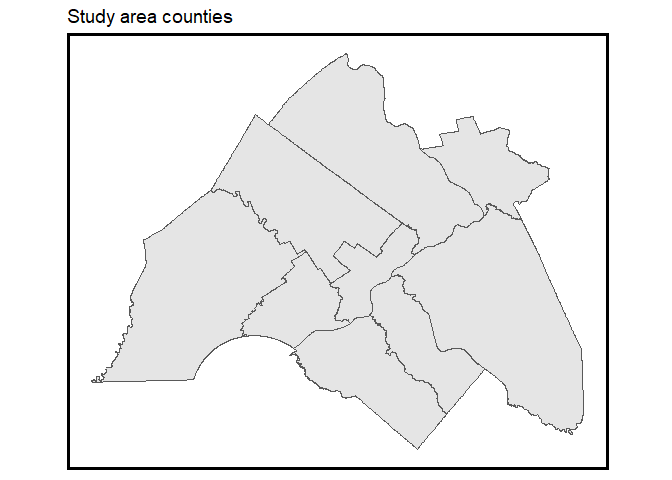<!-- -->
## Create the final dataset
The final step is to combine all feature layers into a dataset for analysis. Fishnet layers are merged, needed features are extracted, and the final dataset is joined with studyAreaCounties to assign grid cells to counties. 


``` r
dat <- 
  cbind(
    fishnet, highwayPoints_fishnet, fishnetPopulation, aggregatedRasters) %>%
  dplyr::select(lc_change, developed, forest, farm, wetlands, otherUndeveloped, water,
                pop_2000, pop_2010, pop_Change, distance_highways,lagDevelopment) %>%
  st_join(studyAreaCounties) %>%
  mutate(developed10 = ifelse(lc_change == 1 & developed == 1, 0, developed)) %>%
  filter(water == 0) 
```
# Exploratory Analysis
In this section we explore the extent to which each features is associated with development change. In this section, we examine how each feature relates to development change. Since the dependent variable is binary—whether a grid cell was developed between 2001 and 2011—the focus is on identifying significant differences between areas that developed and those that didn’t.

The spatial lag (i.e. the calculation of spatial weighted average) to 2001 development illustrates development probabilities. Higher chance of development occurs in the periphery of the region and close to certain sections of the highway networks.

``` r
dat %>%
  dplyr::select(distance_highways,lagDevelopment,lc_change) %>%
  gather(Variable, Value, -lc_change, -geometry) %>%
    ggplot(., aes(lc_change, Value, fill=lc_change,), Variable[!is.na(Variable$lc_change),]) + 
  geom_bar(position = "dodge", stat = "summary", fun.y = "mean") +
  facet_wrap(~Variable) +
  scale_fill_manual(values = palette2,na.translate = F,
                    labels=c("No Change","New Development"),
                    name="") +
  labs(title="New development as a function of the countinuous variables") +
  plotTheme()
```

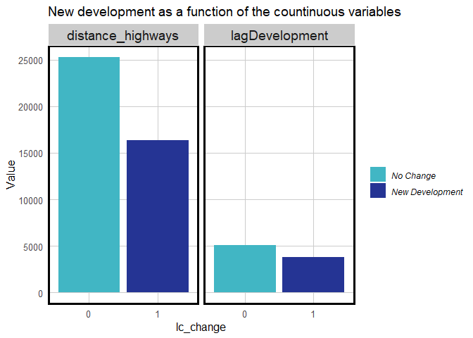<!-- -->
Next, the same visualization is created for the population related variables. 


``` r
dat %>%
  dplyr::select(pop_2000,pop_2010,pop_Change,lc_change) %>%
  gather(Variable, Value, -lc_change, -geometry) %>%
  ggplot(., aes(lc_change, Value, fill=lc_change)) + 
  geom_bar(position = "dodge", stat = "summary", fun.y = "mean") +
  facet_wrap(~Variable) +
  scale_fill_manual(values = palette2,na.translate = F,
                    labels=c("No Change","New Development"),
                    name="") +
  labs(title="New development as a function of factor variables") +
  plotTheme()
```

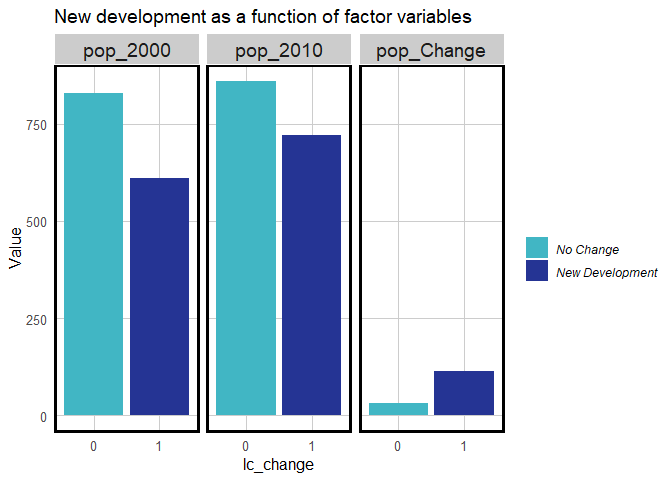<!-- -->
Land cover change also indicated positive correlation with population change from 2000 to 2001. Among different types of land cover,farmland has the highest conversion rate, follow by developed land and forests, at 1.16%, 1.07%, and 0.67% respectively.

``` r
dat %>%
  dplyr::select(lc_change:otherUndeveloped,developed) %>%
  gather(Land_Cover_Type, Value, -lc_change, -geometry) %>%
  st_set_geometry(NULL) %>%
  group_by(lc_change, Land_Cover_Type) %>%
  summarize(n = sum(as.numeric(Value))) %>%
  ungroup() %>%
  mutate(Conversion_Rate = paste0(round(100 * n/sum(n), 2), "%")) %>%
  filter(lc_change == 1) %>%
  dplyr::select(Land_Cover_Type,Conversion_Rate) %>%
  kable() %>% kable_styling(full_width = F)
```

<table class="table" style="width: auto !important; margin-left: auto; margin-right: auto;">
 <thead>
  <tr>
   <th style="text-align:left;"> Land_Cover_Type </th>
   <th style="text-align:left;"> Conversion_Rate </th>
  </tr>
 </thead>
<tbody>
  <tr>
   <td style="text-align:left;"> developed </td>
   <td style="text-align:left;"> 1.07% </td>
  </tr>
  <tr>
   <td style="text-align:left;"> farm </td>
   <td style="text-align:left;"> 1.16% </td>
  </tr>
  <tr>
   <td style="text-align:left;"> forest </td>
   <td style="text-align:left;"> 0.67% </td>
  </tr>
  <tr>
   <td style="text-align:left;"> otherUndeveloped </td>
   <td style="text-align:left;"> 0.05% </td>
  </tr>
  <tr>
   <td style="text-align:left;"> wetlands </td>
   <td style="text-align:left;"> 0.26% </td>
  </tr>
</tbody>
</table>
# Predicting for 2010
In this section, six logistic regression models are estimated to predict development change from 2001 to 2011, with each model increasing in complexity. The data is split into 50% training and test sets, and models are estimated on the training set.
Instead of detailed results tables for each model, we simplify by using the McFadden "Pseudo" R-Squared statistic on the test set to evaluate performance. The model with the best fit is then used for prediction.  

## Modeling
First, dat is split into training and test sets. 

``` r
set.seed(3456)
trainIndex <- 
  createDataPartition(dat$developed, p = .50,
                      list = FALSE,
                      times = 1)
datTrain <- dat[ trainIndex,]
datTest  <- dat[-trainIndex,]

nrow(dat)
```

```
## [1] 7182
```
Next six separate glm models are estimated adding new variables for each.
Model1 includes only the 2001 land cover types. Model2 adds the lagDevelopment. Models 3, 4 and 5 attempt three different approaches for modeling population change. Model3 uses population in 2000; Model4 uses 2000 and 2010 population; and Model5 uses population change. By modeling poulation change between 2000 and 2010, the model is well specified to forecast 2020 development by having pop_Change indicate change between 2010 and 2020. Model6 includes distance to the highways, and is the final model employed for prediction.

``` r
Model1 <- glm(lc_change ~ wetlands + forest  + farm + otherUndeveloped, 
              family="binomial"(link="logit"), data = datTrain)

Model2 <- glm(lc_change ~ wetlands + forest  + farm + otherUndeveloped + lagDevelopment, 
              family="binomial"(link="logit"), data = datTrain)

Model3 <- glm(lc_change ~ wetlands + forest  + farm + otherUndeveloped + lagDevelopment + pop_2000, 
              family="binomial"(link="logit"), data = datTrain)          

Model4 <- glm(lc_change ~ wetlands + forest  + farm + otherUndeveloped + lagDevelopment + pop_2000 + 
                pop_2010, 
              family="binomial"(link="logit"), data = datTrain) 

Model5 <- glm(lc_change ~ wetlands + forest  + farm + otherUndeveloped + lagDevelopment + pop_Change, 
              family="binomial"(link="logit"), data = datTrain)              

Model6 <- glm(lc_change ~ wetlands + forest  + farm + otherUndeveloped + lagDevelopment + pop_Change + 
                distance_highways, 
              family="binomial"(link="logit"), data = datTrain) 
```
Create a concise approach for generating and comparing pseudo R-squared values across multiple models.

``` r
modelList <- paste0("Model", 1:6)
map_dfc(modelList, function(x)pR2(get(x)))[4,] %>%
  setNames(paste0("Model",1:6)) %>%
  gather(Model,McFadden) %>%
  ggplot(aes(Model,McFadden)) +
  geom_bar(stat="identity") +
  labs(title= "McFadden R-Squared by Model") +
  plotTheme()
```

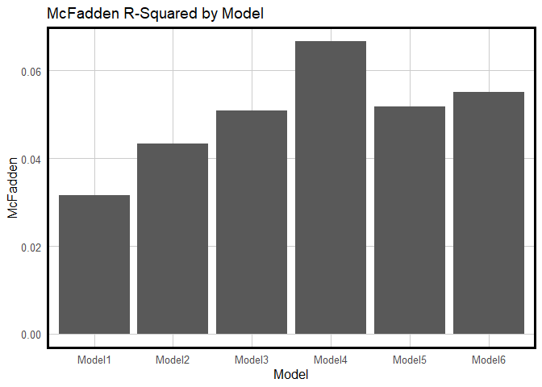<!-- -->
Next, a data frame is created that includes columns for the observed development change, lc_change, and one that includes predicted probabilities for Model6. This data frame is then used as an input to a density plot visualizing the distribution of predicted probabilities by observed class. 


``` r
testSetProbs <- 
  data.frame(class = datTest$lc_change,
             probs = predict(Model6, datTest, type="response")) 

ggplot(testSetProbs, aes(probs)) +
  geom_density(aes(fill=class), alpha=0.5) +
  scale_fill_manual(values = palette2,na.translate = F,
                    labels=c("No Change","New Development")) +
  labs(title = "Histogram of test set predicted probabilities",
       x="Predicted Probabilities",y="Density") +
  plotTheme()
```

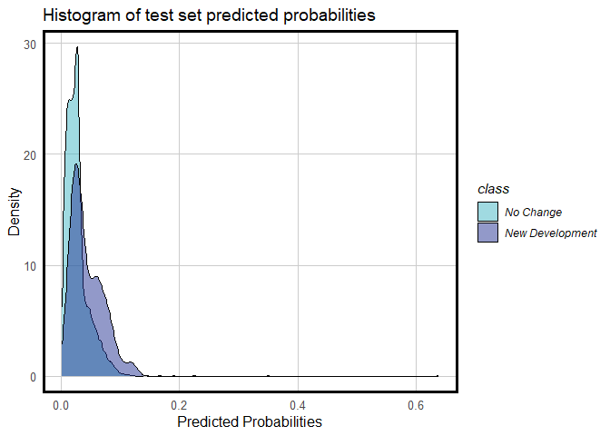<!-- -->
## Accuracy
2010 prediction was based on analysis of six logit regression models. As observed, most developments have been predicted with probabilities of lower than 20%. The model failed to provide robust results. 

``` r
options(yardstick.event_first = FALSE)

testSetProbs <- 
  testSetProbs %>% 
  mutate(predClass_05 = as.factor(ifelse(testSetProbs$probs >= 0.05 ,1,0)),
         predClass_17 = as.factor(ifelse(testSetProbs$probs >= 0.17 ,1,0))) 

testSetProbs %>%
  dplyr::select(-probs) %>%
  gather(Variable, Value, -class) %>%
  group_by(Variable) %>%
  summarize(Sensitivity = round(yardstick::sens_vec(class,factor(Value)),2),
            Specificity = round(yardstick::spec_vec(class,factor(Value)),2),
            Accuracy = round(yardstick::accuracy_vec(class,factor(Value)),2)) %>% 
  kable() %>%
  kable_styling(full_width = F)
```

<table class="table" style="width: auto !important; margin-left: auto; margin-right: auto;">
 <thead>
  <tr>
   <th style="text-align:left;"> Variable </th>
   <th style="text-align:right;"> Sensitivity </th>
   <th style="text-align:right;"> Specificity </th>
   <th style="text-align:right;"> Accuracy </th>
  </tr>
 </thead>
<tbody>
  <tr>
   <td style="text-align:left;"> predClass_05 </td>
   <td style="text-align:right;"> 0.88 </td>
   <td style="text-align:right;"> 0.37 </td>
   <td style="text-align:right;"> 0.86 </td>
  </tr>
  <tr>
   <td style="text-align:left;"> predClass_17 </td>
   <td style="text-align:right;"> 1.00 </td>
   <td style="text-align:right;"> 0.00 </td>
   <td style="text-align:right;"> 0.97 </td>
  </tr>
</tbody>
</table>

For example, 5% threshold correctly predicts a lower number of new development areas (Sensitivity) whereas incorrectly predicts a higher number of not changed areas (Specificity). Similarly, all counties demonstrate higher numbers of incorrect predictions of not changed areas. Thus this model is not representative enough (low generalizability) in 2010 development prediction.


``` r
predsForMap <-         
  dat %>%
  mutate(probs = predict(Model6, dat, type="response") ,
         Threshold_5_Pct = as.factor(ifelse(probs >= 0.05 ,1,0)),
         Threshold_17_Pct =  as.factor(ifelse(probs >= 0.17 ,1,0))) %>%
  dplyr::select(lc_change,Threshold_5_Pct,Threshold_17_Pct) %>%
  gather(Variable,Value, -geometry) %>%
  st_cast("POLYGON")

ggplot() +
  geom_point(data=predsForMap, aes(x=xyC(predsForMap)[,1], y=xyC(predsForMap)[,2], colour=Value)) +
  facet_wrap(~Variable) +
  scale_colour_manual(values = palette2, labels=c("No Change","New Development"),na.translate = F,
                      name="") +
  labs(title="Development predictions - Low threshold") + mapTheme()
```

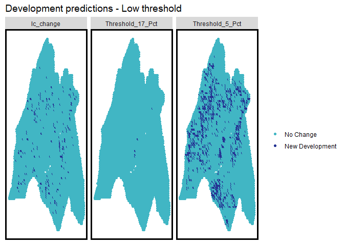<!-- -->
To provide a bit more insight, the code block below produces both true positives (Sensitivity) and true negatives (Specificity) for each grid cell by threshold type.


``` r
ConfusionMatrix.metrics <-
  dat %>%
  mutate(probs = predict(Model6, dat, type="response") ,
         Threshold_5_Pct = as.factor(ifelse(probs >= 0.05 ,1,0)),
         Threshold_17_Pct =  as.factor(ifelse(probs >= 0.17 ,1,0))) %>%
  mutate(TrueP_05 = ifelse(lc_change  == 1 & Threshold_5_Pct == 1, 1,0),
         TrueN_05 = ifelse(lc_change  == 0 & Threshold_5_Pct == 0, 1,0),
         TrueP_17 = ifelse(lc_change  == 1 & Threshold_17_Pct == 1, 1,0),
         TrueN_17 = ifelse(lc_change  == 0 & Threshold_17_Pct == 0, 1,0)) %>%
  dplyr::select(., starts_with("True")) %>%
  gather(Variable, Value, -geometry) %>%
  st_cast("POLYGON") 

ggplot(data=ConfusionMatrix.metrics) +
  geom_point(aes(x=xyC(ConfusionMatrix.metrics)[,1], 
                 y=xyC(ConfusionMatrix.metrics)[,2], colour = as.factor(Value))) +
  facet_wrap(~Variable) +
  scale_colour_manual(values = palette2, labels=c("Correct","Incorrect"),na.translate = F,
                      name="") +
  labs(title="Development predictions - Low threshold") + mapTheme()
```

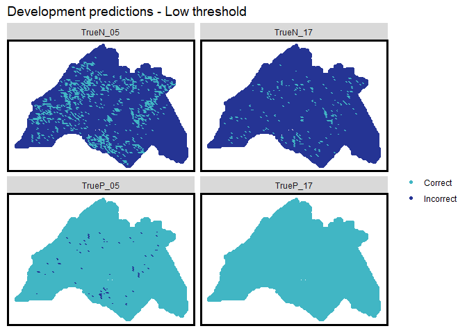<!-- -->

## Generalizability

Spatial cross-validation is used, focusing on generalizability across space. This method tests whether the model performs well in different counties, despite variations in land use or planning.

The model is trained on the remaining counties and then used to predict for the holdout county.


``` r
spatialCV <- function(dataFrame, uniqueID, dependentVariable, modelName) {
  
  #initialize a data frame 
  endList <- list()
  
  #create a list that is all the spatial group unqiue ids in the data frame (ie counties)    
  uniqueID_List <- unique(dataFrame[[uniqueID]])  
  x <- 1
  y <- length(uniqueID_List)
  
  #create a counter and while it is less than the number of counties...  
  while(x <= y) 
  {
    #call a current county    
    currentUniqueID <- uniqueID_List[x]
    #create a training set comprised of units not in that county and a test set of units
    #that are that county
    training <- dataFrame[ which(dataFrame[[uniqueID]] != uniqueID_List[x]),]
    testing <- dataFrame[ which(dataFrame[[uniqueID]] == uniqueID_List[x]),]
    #create seperate xy vectors
    trainingX <- training[ , -which(names(training) %in% c(dependentVariable))]
    testingX <- testing[ , -which(names(testing) %in% c(dependentVariable))]
    
    trainY <- training[[dependentVariable]]
    testY <- testing[[dependentVariable]]
    #Calculate predictions on the test county as part of a data frame including the observed
    #outcome and the unique county ID    
    thisPrediction <- 
      data.frame(class = testY,
                 probs = predict(modelName, testingX, type="response"),
                 county = currentUniqueID) 
    
    #Row bind the predictions to a data farme
    endList <- rbind(endList, thisPrediction)
    #iterate counter    
    x <- x + 1 
  } 
  #return the final list of counties and associated predictions  
  return (as.data.frame(endList))
}
```


``` r
spatialCV_counties <-
  spatialCV(dat,"NAME","lc_change", Model6) %>%
  mutate(predClass = as.factor(ifelse(probs >= 0.17 ,1,0)))
```

To investigate the across-county generalizability of the model, the code block below produces and maps confusion matrix statistics by county. 


``` r
spatialCV_metrics <-
  spatialCV_counties %>% 
  group_by(county) %>% 
  summarize(Observed_Change = sum(as.numeric(as.character(class))),
            Sensitivity = round(yardstick::sens_vec(class,predClass),2),
            Specificity = round(yardstick::spec_vec(class,predClass),2),
            Accuracy = round(yardstick::accuracy_vec(class,predClass),2)) 

spatialCV_metrics %>%
  kable() %>%
  kable_styling(full_width = F)
```

<table class="table" style="width: auto !important; margin-left: auto; margin-right: auto;">
 <thead>
  <tr>
   <th style="text-align:left;"> county </th>
   <th style="text-align:right;"> Observed_Change </th>
   <th style="text-align:right;"> Sensitivity </th>
   <th style="text-align:right;"> Specificity </th>
   <th style="text-align:right;"> Accuracy </th>
  </tr>
 </thead>
<tbody>
  <tr>
   <td style="text-align:left;"> Bucks </td>
   <td style="text-align:right;"> 24 </td>
   <td style="text-align:right;"> 1.00 </td>
   <td style="text-align:right;"> 0 </td>
   <td style="text-align:right;"> 0.98 </td>
  </tr>
  <tr>
   <td style="text-align:left;"> Burlington </td>
   <td style="text-align:right;"> 47 </td>
   <td style="text-align:right;"> 1.00 </td>
   <td style="text-align:right;"> 0 </td>
   <td style="text-align:right;"> 0.97 </td>
  </tr>
  <tr>
   <td style="text-align:left;"> Camden </td>
   <td style="text-align:right;"> 7 </td>
   <td style="text-align:right;"> 1.00 </td>
   <td style="text-align:right;"> 0 </td>
   <td style="text-align:right;"> 0.98 </td>
  </tr>
  <tr>
   <td style="text-align:left;"> Chester </td>
   <td style="text-align:right;"> 35 </td>
   <td style="text-align:right;"> 1.00 </td>
   <td style="text-align:right;"> 0 </td>
   <td style="text-align:right;"> 0.98 </td>
  </tr>
  <tr>
   <td style="text-align:left;"> Delaware </td>
   <td style="text-align:right;"> 9 </td>
   <td style="text-align:right;"> 1.00 </td>
   <td style="text-align:right;"> 0 </td>
   <td style="text-align:right;"> 0.98 </td>
  </tr>
  <tr>
   <td style="text-align:left;"> Gloucester </td>
   <td style="text-align:right;"> 36 </td>
   <td style="text-align:right;"> 1.00 </td>
   <td style="text-align:right;"> 0 </td>
   <td style="text-align:right;"> 0.94 </td>
  </tr>
  <tr>
   <td style="text-align:left;"> Mercer </td>
   <td style="text-align:right;"> 17 </td>
   <td style="text-align:right;"> 1.00 </td>
   <td style="text-align:right;"> 0 </td>
   <td style="text-align:right;"> 0.96 </td>
  </tr>
  <tr>
   <td style="text-align:left;"> Montgomery </td>
   <td style="text-align:right;"> 37 </td>
   <td style="text-align:right;"> 1.00 </td>
   <td style="text-align:right;"> 0 </td>
   <td style="text-align:right;"> 0.96 </td>
  </tr>
  <tr>
   <td style="text-align:left;"> Philadelphia </td>
   <td style="text-align:right;"> 5 </td>
   <td style="text-align:right;"> 0.98 </td>
   <td style="text-align:right;"> 0 </td>
   <td style="text-align:right;"> 0.96 </td>
  </tr>
</tbody>
</table>
# Predicted Demand of Development  

## Predicting land cover demand for 2020
At this point, a simple but useful model has been trained to predict urban development between 2001 and 2011 as a function of baseline features fromm 2001 including land cover, built environment and population. Next, we are going to updated our features to reflect a 2010 baseline. Having done so, predictions from our new model would then be fore 2020.

Generalizability is always the concern when forecasting, and for this use case Planners must ask themselves whether the 2001-2011 Houston experience generalizes to the 2010-2020 Houston experience. In other words, have the macroeconomic real estate conditions changed dramatically between the two time periods? This is question with no definitive answer, but it useful to consider the exogenous factors that may differentiate today’s Houston from that of 2011. The big for instance is climate change, and the aftermath of Hurricane Harvey. In August of 2017 Harvey devastated large portions of this region causing $125 billion in damage. If the real estate market capitalized flood risk into devasted areas going forward, this would effectively change the nature of real estate demand in the region. Thus the pre-flood, 2011 experienced is no longer entirely relavant.

Below, lagDevelopment is mutate describing average distance to 2010 development. Note that the field name, lagDevelopment is unchanged (ie. not updated to lagDevelopment_2010). This is done purposelly as model6 has a regression coefficient called lagDevelopment. If this variable wasn’t present in our updated data frame then the predict command would fail.


``` r
dat <-
  dat %>%
  mutate(lagDevelopment = nn_function(xyC(.), xyC(filter(.,developed10 == 1)),2))

countyPopulation_2020 <- 
  data.frame(
    NAME = 
      c("Bucks","Montgomery","Chester","Philadelphia","Delaware",
        "Mercer","Camden","Gloucester","Burlington"),
    county_projection_2020 = 
      c(640495, 840934, 543702, 1594787, 568337, 377328 , 514006, 307766, 459344)) %>%
  left_join(
    dat %>%
      st_set_geometry(NULL) %>%
      group_by(NAME) %>%
      summarize(county_population_2010 = round(sum(pop_2010))))

countyPopulation_2020 %>%
  gather(Variable,Value, -NAME) %>%
  ggplot(aes(reorder(NAME,-Value),Value)) +
  geom_bar(aes(fill=Variable), stat = "identity") +
  scale_fill_manual(values = palette2,
                    labels=c("2020","2010"),
                    name="Population") +
  labs(title="Population Change by county: 2010 - 2020",
       x="County", y="Population") +
  theme(axis.text.x = element_text(angle = 45, hjust = 1)) +
  plotTheme()
```

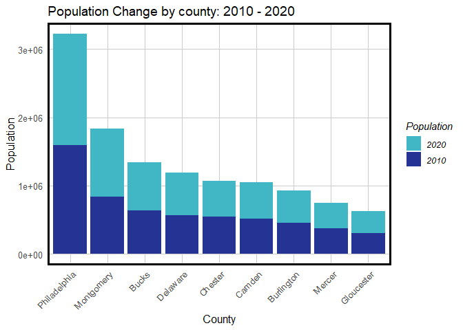<!-- -->

## Demand-driven Development
According to DVRPC (2016), population will continue increasing in the coming ten to thirty years.2 Chester County and Gloucester County will witness close to one-third of population growth – the largest increase in density in the region. Similar trends of population change per county are demonstrated by the model. Based on the population projection in 2020, it is observed that development demand concentrates in Chester and Gloucester Counties and the northern periphery of Bucks, Montgomery, Burlington and Mercer Counties.

Both Bucks County and Burlington County are projected among the lowest population growth based on the current topography. However, both counties demonstrate potential connectors to edge cities of the Greater Philadelphia Region – in particular, north Bucks County is projected to hold roughly 30% to 50% increase of employment. (DVRPC, 2017) To leverage growth, a new highway is proposed crossing North Philly, reaching the north crossing the boundary of Montgomery and Bucks County and Burlington County, and connecting Allentown East and Atlantic City in the north and south respectively.
The 2020 predicted development demands, therefore further intensify in Bucks and
Burlington Counties where the highway is proposed.


``` r
dat_infill <-
  dat %>%
  #calculate population change
  left_join(countyPopulation_2020) %>%
  mutate(proportion_of_county_pop = pop_2010 / county_population_2010,
         pop_2020.infill = proportion_of_county_pop * county_projection_2020,
         pop_Change = round(pop_2020.infill - pop_2010),2) %>%
  dplyr::select(-county_projection_2020, -county_population_2010, 
                -proportion_of_county_pop, -pop_2020.infill) %>%
  #predict for 2020
  mutate(predict_2020.infill = predict(Model6,. , type="response"))

dat_infill %>%
  ggplot() +  
  geom_point(aes(x=xyC(dat_infill)[,1], y=xyC(dat_infill)[,2], colour = factor(ntile(predict_2020.infill,5)))) +
  scale_colour_manual(values = palette5,
                      labels=substr(quintileBreaks(dat_infill,"predict_2020.infill"),1,4),
                      name="Quintile\nBreaks") +
  geom_sf(data=studyAreaCounties, fill=NA, colour="black", size=1.5) +
  labs(title= "Development Demand in 2020: Predicted Probabilities") +
  mapTheme()
```

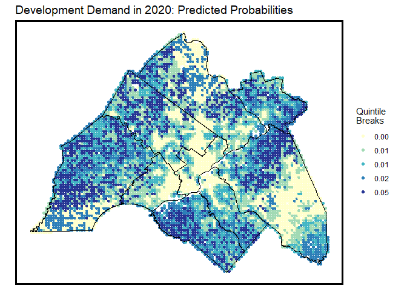<!-- -->
## Supply-driven Development
Both Bucks County and Burlington County are projected among the lowest population growth
based on the current topography. However, both counties demonstrate potential connectors to edge cities of the Greater Philadelphia Region – in particular, north Bucks County is projected to hold roughly 30% to 50% increase of employment. (DVRPC, 2017) To leverage growth, a new highway is proposed crossing North Philly, reaching the north crossing the boundary of Montgomery and Bucks County and Burlington County, and connecting Allentown East and Atlantic City in the north and south respectively.
The 2020 predicted development demands, therefore further intensify in Bucks and
Burlington Counties where the highway is proposed.


``` r
NEWHighways <-
  read_sf("Data/new_highways.shp") %>%
  st_transform(st_crs(DVR)) %>%
  st_intersection(DVR)
ggplot() +
  geom_point(data=fishnet, 
             aes(x=xyC(fishnet)[,1], y=xyC(fishnet)[,2],colour=lc_change),size=1.5) +
  geom_sf(data=NEWHighways) +
  scale_colour_manual(values = palette2,na.translate = F,
                      labels=c("No Change","New Development")) +
  labs(title = "New Development and Highways",
       subtitle = "As fishnet centroids") +
  mapTheme()
```

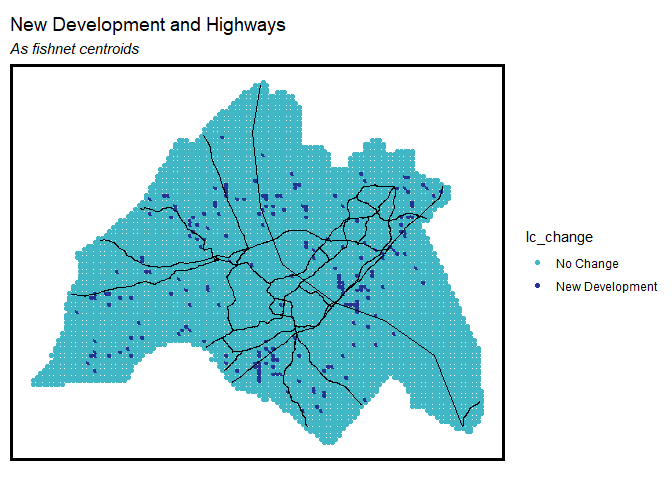<!-- -->

``` r
emptyRaster2 <- lc_change
emptyRaster2[] <- NA

NEWhighway_raster <- 
  as(NEWHighways,'Spatial') %>%
  rasterize(.,emptyRaster)

NEWhighway_raster_distance <- distance(NEWhighway_raster)
names(NEWhighway_raster_distance) <- "new_distance_highways"

NEWhighwayPoints <-
  rasterToPoints(NEWhighway_raster_distance) %>%
  as.data.frame() %>%
  st_as_sf(coords = c("x", "y"), crs = st_crs(DVR_fishnet))


NEWhighwayPoints_fishnet <- 
  aggregate(NEWhighwayPoints, DVR_fishnet, mean) %>%
  mutate(new_distance_highways = ifelse(is.na(new_distance_highways),0,new_distance_highways))

ggplot() +
  geom_sf(data=DVR) +
  geom_point(data=NEWhighwayPoints_fishnet, aes(x=xyC(NEWhighwayPoints_fishnet)[,1], 
                                             y=xyC(NEWhighwayPoints_fishnet)[,2], 
                                             colour=factor(ntile(new_distance_highways,5))),size=1.5) +
  scale_colour_manual(values = palette5,
                      labels=substr(quintileBreaks(NEWhighwayPoints_fishnet,"new_distance_highways"),1,8),
                      name="Quintile\nBreaks") +
  geom_sf(data=NEWHighways, colour = "red") +
  labs(title = "Distance to NEW Highways",
       subtitle = "As fishnet centroids; Highways visualized in red") +
  mapTheme()
```

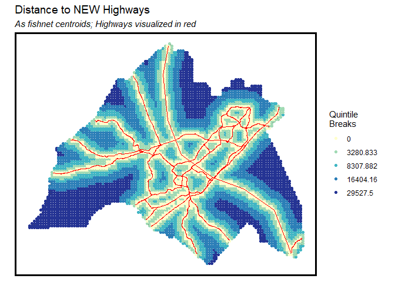<!-- -->

``` r
dat2 <- 
  cbind(
    fishnet, NEWhighwayPoints_fishnet, fishnetPopulation, aggregatedRasters) %>%
  dplyr::select(lc_change, developed, forest, farm, wetlands, otherUndeveloped, water,
                pop_2000, pop_2010, pop_Change, new_distance_highways,lagDevelopment) %>%
  st_join(studyAreaCounties) %>%
  mutate(developed10 = ifelse(lc_change == 1 & developed == 1, 0, developed)) %>%
  filter(water == 0) 

dat2 %>%
  mutate(new_distance_highways = replace_na(new_distance_highways, 0)) 

dat2 %>%
  mutate(lc_change = replace_na(lc_change, 0)) 

dat2 %>%
  dplyr::select(new_distance_highways,lagDevelopment,lc_change) %>%
  gather(Variable, Value, -lc_change, -geometry) 

dat2 %>%
  dplyr::select(pop_2000,pop_2010,pop_Change,lc_change) %>%
  gather(Variable, Value, -lc_change, -geometry)

dat2 %>%
  dplyr::select(lc_change:otherUndeveloped,developed) %>%
  gather(Land_Cover_Type, Value, -lc_change, -geometry) %>%
  st_set_geometry(NULL) %>%
  group_by(lc_change, Land_Cover_Type) %>%
  summarize(n = sum(as.numeric(Value))) %>%
  ungroup() %>%
  mutate(Conversion_Rate = paste0(round(100 * n/sum(n), 2), "%")) %>%
  filter(lc_change == 1) %>%
  dplyr::select(Land_Cover_Type,Conversion_Rate) %>%
  kable() %>% kable_styling(full_width = F)

set.seed(3456)
trainIndex2 <- 
  createDataPartition(dat2$developed, p = .50,
                      list = FALSE,
                      times = 1)
datTrain2 <- dat2[ trainIndex2,]
datTest2  <- dat2[-trainIndex2,]

nrow(dat2)

Model11 <- glm(lc_change ~ wetlands + forest  + farm + otherUndeveloped, 
              family="binomial"(link="logit"), data = datTrain2)

Model12 <- glm(lc_change ~ wetlands + forest  + farm + otherUndeveloped + lagDevelopment, 
              family="binomial"(link="logit"), data = datTrain2)

Model13 <- glm(lc_change ~ wetlands + forest  + farm + otherUndeveloped + lagDevelopment + pop_2000, 
              family="binomial"(link="logit"), data = datTrain2)          

Model14 <- glm(lc_change ~ wetlands + forest  + farm + otherUndeveloped + lagDevelopment + pop_2000 + 
                pop_2010, 
              family="binomial"(link="logit"), data = datTrain2) 

Model15 <- glm(lc_change ~ wetlands + forest  + farm + otherUndeveloped + lagDevelopment + pop_Change, 
              family="binomial"(link="logit"), data = datTrain2)              

 
Model16 <- glm(lc_change ~ wetlands + forest  + farm + otherUndeveloped + lagDevelopment + pop_Change + 
                new_distance_highways, 
              family="binomial"(link="logit"), data = datTrain2) 


modelList <- paste0("Model", 11:16)
map_dfc(modelList, function(x)pR2(get(x)))[4,] %>%
  setNames(paste0("Model",11:16)) %>%
  gather(Model,McFadden)

testSetProbs2 <- 
  data.frame(class2 = datTest2$lc_change,
             probs2 = predict(Model16, datTest2, type="response")) 

options(yardstick.event_first = FALSE)

testSetProbs2 <- 
  testSetProbs2 %>% 
  mutate(predClass2_05 = as.factor(ifelse(testSetProbs2$probs2 >= 0.05 ,1,0)),
         predClass2_17 = as.factor(ifelse(testSetProbs2$probs2 >= 0.17 ,1,0))) 

testSetProbs2 %>%
  dplyr::select(-probs2) %>%
  gather(Variable, Value, -class2) %>%
  group_by(Variable) %>%
  summarize(Sensitivity = round(yardstick::sens_vec(class2,factor(Value)),2),
            Specificity = round(yardstick::spec_vec(class2,factor(Value)),2),
            Accuracy = round(yardstick::accuracy_vec(class2,factor(Value)),2))

predsForMap2 <-         
  dat2 %>%
  mutate(probs2 = predict(Model16, dat2, type="response") ,
         Threshold_5_Pct = as.factor(ifelse(probs2 >= 0.05 ,1,0)),
         Threshold_17_Pct =  as.factor(ifelse(probs2 >= 0.17 ,1,0))) %>%
  dplyr::select(lc_change,Threshold_5_Pct,Threshold_17_Pct) %>%
  gather(Variable,Value, -geometry) %>%
  st_cast("POLYGON")

ConfusionMatrix.metrics2 <-
  dat2 %>%
  mutate(probs2 = predict(Model16, dat2, type="response") ,
         Threshold_5_Pct = as.factor(ifelse(probs2 >= 0.05 ,1,0)),
         Threshold_17_Pct =  as.factor(ifelse(probs2 >= 0.17 ,1,0))) %>%
  mutate(TrueP_05 = ifelse(lc_change  == 1 & Threshold_5_Pct == 1, 1,0),
         TrueN_05 = ifelse(lc_change  == 0 & Threshold_5_Pct == 0, 1,0),
         TrueP_17 = ifelse(lc_change  == 1 & Threshold_17_Pct == 1, 1,0),
         TrueN_17 = ifelse(lc_change  == 0 & Threshold_17_Pct == 0, 1,0)) %>%
  dplyr::select(., starts_with("True")) %>%
  gather(Variable, Value, -geometry) %>%
  st_cast("POLYGON") 

spatialCV <- function(dataFrame, uniqueID, dependentVariable, modelName) {
  
  #initialize a data frame 
  endList <- list()
  
  #create a list that is all the spatial group unqiue ids in the data frame (ie counties)    
  uniqueID_List <- unique(dataFrame[[uniqueID]])  
  x <- 1
  y <- length(uniqueID_List)
  
  #create a counter and while it is less than the number of counties...  
  while(x <= y) 
  {
    #call a current county    
    currentUniqueID <- uniqueID_List[x]
    #create a training set comprised of units not in that county and a test set of units
    #that are that county
    training2 <- dataFrame[ which(dataFrame[[uniqueID]] != uniqueID_List[x]),]
    testing2 <- dataFrame[ which(dataFrame[[uniqueID]] == uniqueID_List[x]),]
    #create seperate xy vectors
    trainingX2 <- training2[ , -which(names(training) %in% c(dependentVariable))]
    testingX2 <- testing2[ , -which(names(testing) %in% c(dependentVariable))]
    
    trainY2 <- training2[[dependentVariable]]
    testY2 <- testing2[[dependentVariable]]
    #Calculate predictions on the test county as part of a data frame including the observed
    #outcome and the unique county ID    
    thisPrediction2 <- 
      data.frame(class = testY,
                 probs = predict(modelName, testingX2, type="response"),
                 county = currentUniqueID) 
    
    #Row bind the predictions to a data farme
    endList2 <- rbind(endList2, thisPrediction2)
    #iterate counter    
    x <- x + 1 
  } 
  #return the final list of counties and associated predictions  
  return (as.data.frame(endList))
}


dat2 <-
  dat2 %>%
  mutate(lagDevelopment = nn_function(xyC(.), xyC(filter(.,developed10 == 1)),2))

countyPopulation_2020 <- 
  data.frame(
    NAME = 
      c("Bucks","Montgomery","Chester","Philadelphia","Delaware",
        "Mercer","Camden","Gloucester","Burlington"),
    county_projection_2020 = 
      c(640495, 840934, 543702, 1594787, 568337, 377328 , 514006, 307766, 459344)) %>%
  left_join(
    dat %>%
      st_set_geometry(NULL) %>%
      group_by(NAME) %>%
      summarize(county_population_2010 = round(sum(pop_2010))))

countyPopulation_2020 %>%
  gather(Variable,Value, -NAME) 

dat_infill2 <-
  dat2 %>%
  #calculate population change
  left_join(countyPopulation_2020) %>%
  mutate(proportion_of_county_pop = pop_2010 / county_population_2010,
         pop_2020.infill = proportion_of_county_pop * county_projection_2020,
         pop_Change = round(pop_2020.infill - pop_2010),2) %>%
  dplyr::select(-county_projection_2020, -county_population_2010, 
                -proportion_of_county_pop, -pop_2020.infill) %>%
  #predict for 2020
  mutate(predict_2020.infill = predict(Model16,. , type="response"))

dat_infill2 %>%
  ggplot() +  
  geom_point(aes(x=xyC(dat_infill2)[,1], y=xyC(dat_infill2)[,2], colour = factor(ntile(predict_2020.infill,5)))) +
  scale_colour_manual(values = palette5,
                      labels=substr(quintileBreaks(dat_infill2,"predict_2020.infill"),1,4),
                      name="Quintile\nBreaks") +
  geom_sf(data=studyAreaCounties, fill=NA, colour="black", size=1.5) +
  labs(title= "Development Demand in 2020: Predicted Probabilities") +
  mapTheme()
```

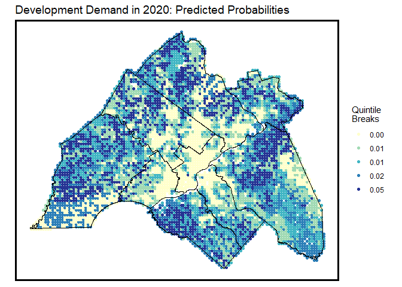<!-- -->

# Comparing predicted development demand & environmental sensitivity
We now have a strong indicator of development demand for 2020 to guide local land use planning. However, demand must be balanced with the supply of environmentally sensitive land.

In this analysis, farmland and undeveloped land are deemed suitable, while wetlands and forests are classified as not suitable. Below, 2011 land cover data is analyzed, and several measures of environmental sensitivity are created by county:

Total wetlands and forest land cover in 2011.
Sensitive land (wetlands and forests) lost between 2001 and 2011.
Total area of large sensitive landscape ‘patches’ in 2011.
The third metric relates to landscape fragmentation, where discontinuous development reduces biodiversity for species that need space. We create environmentally sensitive regions to represent large areas of unfragmented natural resources and consider the total area of these regions for each county.  


## 2011 Land Cover data
To begin, the 2011 Land Cover data is read in and reclassified.

``` r
lc_2011 <- raster("Data/lc_2011_1kproj.tif")

developed11 <- lc_2011 == 21 | lc_2011 == 22 | lc_2011 == 23 | lc_2011 == 24
forest11 <- lc_2011 == 41 | lc_2011 == 42 | lc_2011 == 43 
farm11 <- lc_2011 == 81 | lc_2011 == 82 
wetlands11 <- lc_2011 == 90 | lc_2011 == 95 
otherUndeveloped11 <- lc_2011 == 52 | lc_2011 == 71 | lc_2011 == 31 
water11 <- lc_2011 == 11

names(developed11) <- "developed11"
names(forest11) <- "forest11"
names(farm11) <- "farm11"
names(wetlands11) <- "wetlands11"
names(otherUndeveloped11) <- "otherUndeveloped11"
names(water11) <- "water11"

ggplot() +
  geom_sf(data=DVR) +
  geom_raster(data = rbind(rast(lc_2001) %>% mutate(label = "2001"),
                           rast(lc_2011) %>% mutate(label = "2011")) %>% 
                na.omit %>% filter(value > 0), 
              aes(x,y,fill=as.factor(value))) +
  facet_wrap(~label) +
  scale_fill_viridis(discrete=TRUE, name ="") +
  labs(title = "Land Cover, 2001 & 2011a") +
  mapTheme() + theme(legend.position = "none")
```

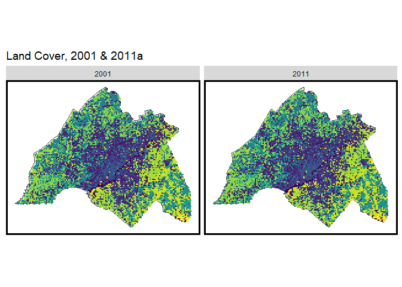<!-- -->

Next, each raster is aggregated to the fishnet using the aggregateRaster function and 2011 land cover types are mapped.


``` r
theRasterList11 <- c(developed11,forest11,farm11,wetlands11,otherUndeveloped11,water11)

dat2 <-
  aggregateRaster(theRasterList11, dat) %>%
  dplyr::select(developed11,forest11,farm11,wetlands11,otherUndeveloped11,water11) %>%
  st_set_geometry(NULL) %>%
  bind_cols(.,dat) %>%
  st_sf() %>%
  st_cast("POLYGON")

dat2 %>%
  gather(var,value,developed11:water11) %>%
  st_centroid() %>%
  mutate(X = st_coordinates(.)[,1],
         Y = st_coordinates(.)[,2]) %>%
  ggplot() +
  geom_sf(data=DVR) +
  geom_point(aes(X,Y, colour=as.factor(value))) +
  facet_wrap(~var) +
  scale_colour_manual(values = palette2,
                      labels=c("Other","Land Cover"),
                      name = "") +
  labs(title = "Land cover types, 2011",
       subtitle = "As fishnet centroids") +
  mapTheme()
```

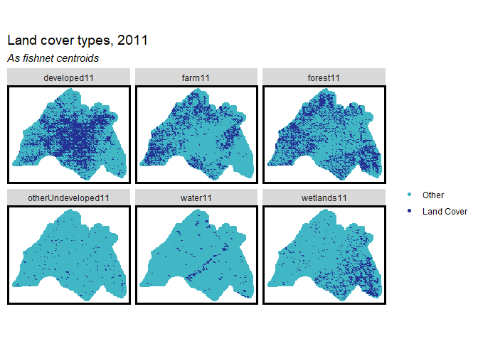<!-- -->

##Sensitive land lover lost

An environmental sensitivity analysis cross-examines the effects of the proposed transportation
infrastructure. The predicted development, however, will evade forests and wetlands, as concentrated in southern New Jersey and other counties.


``` r
dat2 <-
  dat2 %>%
  mutate(sensitive_lost11 = ifelse(forest == 1 & forest11 == 0 |
                                     wetlands == 1 & wetlands11 == 0,1,0))

ggplot() +
  geom_point(data=dat2, aes(x=xyC(dat2)[,1], y=xyC(dat2)[,2], colour=as.factor(sensitive_lost11))) +
  scale_colour_manual(values = palette2,
                      labels=c("No Change","Sensitive Lost"),
                      name = "") +
  labs(title = "Sensitive lands lost: 2001 - 2011",
       subtitle = "As fishnet centroids") +
  mapTheme()
```

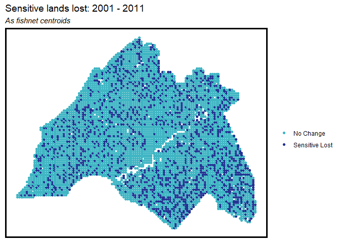<!-- -->
## Landscape fragmentation
In this section, the wetlands11 and forest11 rasters are converted to contiguous sensitive_regions using the raster::clump function. This is equivalent to Region Group in ArcGIS. The raster clumps are then converted to vector sf layers; dissolved into unique regions; Acres are calculated; and the layers are converted back to raster to be extracted back to the fishnet with aggregateRaster. 


``` r
sensitiveRegions <- 
  clump(wetlands11 + forest11) %>%
  rasterToPolygons() %>%
  st_as_sf() %>%
  group_by(clumps) %>% summarize() %>%
  mutate(Acres = as.numeric(st_area(.) * 0.0000229568)) %>%
  filter(Acres > 3954)  %>%
  dplyr::select() %>%
  rasterize(.,emptyRaster) 
sensitiveRegions[sensitiveRegions > 0] <- 1  
names(sensitiveRegions) <- "sensitiveRegions"

dat2 <-
  aggregateRaster(c(sensitiveRegions), dat2) %>%
  dplyr::select(sensitiveRegions) %>%
  st_set_geometry(NULL) %>%
  bind_cols(.,dat2) %>%
  st_sf()

ggplot() +
  geom_point(data=dat2, aes(x=xyC(dat2)[,1], y=xyC(dat2)[,2], colour=as.factor(sensitiveRegions))) +
  scale_colour_manual(values = palette2,
                      labels=c("Other","Sensitive Regions"),
                      name="") +
  labs(title = "Sensitive regions",
       subtitle = "Continous areas of either wetlands or forests\ngreater than 1 acre") +
  mapTheme()
```

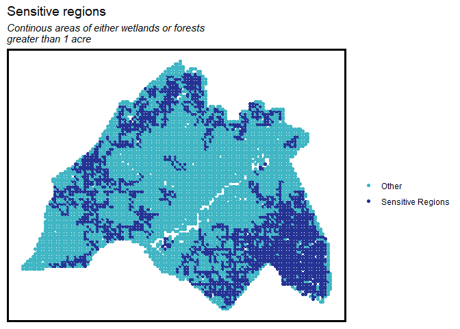<!-- -->

## Summarize by county

``` r
county_specific_metrics <- 
  dat2 %>%
  #predict development demand from our model
  mutate(Development_Demand = predict(Model6, dat2, type="response")) %>%
  #get a count count of grid cells by county which we can use to calculate rates below
  left_join(st_set_geometry(dat, NULL) %>% group_by(NAME) %>% summarize(count = n())) %>%
  #calculate summary statistics by county
  group_by(NAME) %>%
  summarize(Total_Farmland = sum(farm11) / max(count),
            Total_Forest = sum(forest11) / max(count),
            Total_Wetlands = sum(wetlands11) / max(count),
            Total_Undeveloped = sum(otherUndeveloped11) / max(count),
            Sensitive_Land_Lost = sum(sensitive_lost11) / max(count),
            Sensitive_Regions = sum(sensitiveRegions) / max(count),
            Mean_Development_Demand = mean(Development_Demand)) %>%
  #get population data by county
  left_join(countyPopulation_2020 %>% 
              mutate(Population_Change = county_projection_2020 - county_population_2010,
                     Population_Change_Rate = Population_Change / county_projection_2020) %>%
              dplyr::select(NAME,Population_Change_Rate))
```
Now a small multiple plot can be created providing both supply and demand side analytics by county. The plot gives a sense for development demand (Demand-Side), suitable land for development (Suitable) and sensitive land (Not Suitable).

In Fort Bend County, an area west of Houston, the data suggests both population and development demand will increase. At the same time, there is a high rate of developable farmland and a low supply of senstive land. Fort Bend is well suitabed to new development.

Conversely, San Jacinto, the county north and east of Houston, contains some of the highest rates of senstive land use in the region. There is a very large National Forest in this area. In most counties, there are some real trade-offs to be made between suitable/sensitive land and development pressure.

``` r
county_specific_metrics %>%
  gather(Variable, Value, -NAME, -geometry) %>%
  mutate(Variable = factor(Variable, levels=c("Population_Change_Rate","Mean_Development_Demand",
                                              "Total_Farmland","Total_Undeveloped","Total_Forest",
                                              "Total_Wetlands","Sensitive_Land_Lost","Sensitive_Regions",
                                              ordered = TRUE))) %>%
  mutate(Planning_Designation = case_when(
    Variable == "Population_Change_Rate" | Variable == "Mean_Development_Demand" ~ "Demand-Side",
    Variable == "Total_Farmland" | Variable == "Total_Undeveloped"               ~ "Suitable",
    TRUE                                                                         ~ "Not Suitable")) %>%
  ggplot(aes(x=Variable, y=Value, fill=Planning_Designation)) +
  geom_bar(stat="identity", position=position_dodge(), colour="black") +
  facet_wrap(~NAME, ncol=5) +
  coord_flip() +
  scale_y_continuous(breaks = seq(.25, 1, by = .25)) +
  geom_vline(xintercept = 2.5) + geom_vline(xintercept = 4.5) +
  scale_fill_manual(values=c("black","orange","green")) +
  labs(title= "County Specific Allocation Metrics", subtitle= "As rates", x="Indicator", y="Rate") +
  plotTheme() + theme(axis.text.x = element_text(angle = 45, hjust = 1), legend.position="bottom")
```

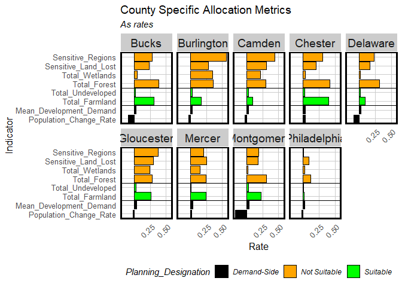<!-- -->
#Allocation
Allocation is the final stage of the urban growth modeling process. 
The following figures summarize this study by showing the development potential of each county. Development demand implies growth opportunities including jobs, real estate investment, small business and retail supporting bedroom communities. On the other hand, however, the projected growth in density unveiled a possible pattern of urban sprawl to north Bucks County. The proposed highway further connects north Bucks County and South Jersey where most land is currently Conservation Focused Areas (CFA). The environmental sensitivity analysis further revealed vulnerable preserved land that may be invaded under urban sprawl. While the consequent highway-oriented development is inevitable, your office is suggested to observe closely residential and commercial development along the new highway. In particular, CFA should continue as a tool in the growth control mechanism. Your office should work with relevant parties to study the land value and release land for development. Legislation and regulations should be formulated as precaution of over-development.

``` r
Philadelphia <-
  dat2 %>%
  mutate(Development_Demand = predict(Model6, dat2, type="response")) %>%
  filter(NAME == "Philadelphia") 

Philadelphia_landUse <- rbind(
  filter(Philadelphia, forest11 == 1 | wetlands11 == 1 ) %>%
    dplyr::select() %>% mutate(Land_Use = "Not Suitable"),
  filter(Philadelphia, developed11 == 1) %>%
    dplyr::select() %>% mutate(Land_Use = "Developed"))

grid.arrange(
  ggplot() +
    geom_sf(data=Philadelphia, aes(fill=factor(ntile(Development_Demand,5))), colour=NA) +
    geom_point(data=Philadelphia_landUse, aes(x=xyC(Philadelphia_landUse)[,1], 
                                          y=xyC(Philadelphia_landUse)[,2], colour=Land_Use),
               shape = 15, size = 2) +
    geom_sf(data=st_intersection(DVRHighways,filter(studyAreaCounties, NAME=="Philadelphia")), size=2) +
    scale_fill_manual(values = palette5, name="Development\nDemand",
                      labels=substr(quintileBreaks(Philadelphia,"Development_Demand"),1,5)) +
    scale_colour_manual(values = c("black","red")) + 
    labs(title = "Development Potential, 2020: Philadelphia") + mapTheme() +
    guides(fill = guide_legend(order = 1), colour = guide_legend(order = 2)),
  
  ggplot() +
    geom_sf(data=Philadelphia, aes(fill=factor(ntile(pop_Change,5))), colour=NA) +
    geom_point(data=Philadelphia_landUse, aes(x=xyC(Philadelphia_landUse)[,1], 
                                          y=xyC(Philadelphia_landUse)[,2], colour=Land_Use),
               shape = 15, size = 2) +
    geom_sf(data=st_intersection(DVRHighways,filter(studyAreaCounties, NAME=="Philadelphia")), size=2) +
    scale_fill_manual(values = palette5, name="Population\nChange",
                      labels=substr(quintileBreaks(Philadelphia,"pop_Change"),1,5)) +
    scale_colour_manual(values = c("black","red")) + 
    labs(title = "Projected Population, 2020: Philadelphia") + mapTheme() +
    guides(fill = guide_legend(order = 1), colour = guide_legend(order = 2)), ncol=2)
```

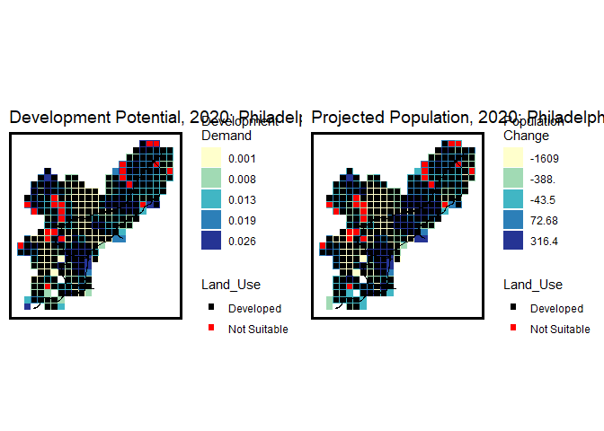<!-- -->
  
